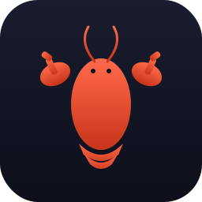

<p align="center">
  
</p>

# OpenClaw on StartOS

> **Upstream repo:** <https://github.com/openclaw/openclaw>
> **Targets:** StartOS 0.4.0 (tested against beta-5)

[OpenClaw](https://openclaw.ai) is a personal AI assistant — a single-user gateway that connects to messaging channels (WhatsApp, Telegram, Slack, Discord, Signal, Matrix, IRC, and many others) and exposes a Control UI for managing sessions, channels, tools, and skills. Bring your own model API keys; OpenClaw is the runtime, not the model.

This repository builds OpenClaw as an `s9pk` package for **StartOS 0.4.0**, sideloadable from the StartOS UI.

---

## Build

### Prerequisites

Install the build environment per the [StartOS packaging environment setup](https://docs.start9.com/packaging/0.4.0.x/environment-setup.html):

- Docker
- Node.js 22 (LTS)
- `make`, `squashfs-tools`
- [`start-cli`](https://github.com/Start9Labs/start-cli) — `curl -fsSL https://start9labs.github.io/start-cli/install.sh | sh`

### Clone with submodule

This repo pulls OpenClaw upstream as a git submodule. Clone with `--recurse-submodules`:

```sh
git clone --recurse-submodules https://github.com/openclaw/openclaw-startos.git
cd openclaw-startos
```

If you already cloned without `--recurse-submodules`:

```sh
git submodule update --init
```

### Build the package

```sh
npm install
make x86_64        # or `make aarch64`, or `make` for both
```

This produces `openclaw_x86_64.s9pk` (or `openclaw_aarch64.s9pk`) in the repo root. The build step does a full upstream OpenClaw Docker build (multi-stage, Node 24, pnpm install, UI build) — expect 10–20 minutes on a typical machine, faster on subsequent rebuilds thanks to the BuildKit cache mounts in the upstream Dockerfile.

### Install

Open the StartOS UI, go to **Sideload**, and upload the `.s9pk` file.

---

## Build via GitHub Actions (no local Docker needed)

The repo ships a self-contained workflow at `.github/workflows/build.yml` that builds the `.s9pk` for both `x86_64` and `aarch64` on GitHub's runners.

To get a built `.s9pk` without setting up a local build environment:

1. Push this repo to GitHub (any visibility — public or private).
2. The workflow runs automatically on every push to `main`/`master`. You can also trigger it manually from the **Actions** tab via **Build s9pk → Run workflow**.
3. When the run finishes (~30 minutes — `aarch64` is slow because it builds under QEMU), open the run summary and download the **openclaw-x86_64.s9pk** or **openclaw-aarch64.s9pk** artifact.

To produce a downloadable **GitHub Release** (with the `.s9pk` files attached for easy linking):

```sh
git tag v2026.4.23
git push --tags
```

The workflow will build, then publish a release at `https://github.com/<your>/<repo>/releases/tag/v2026.4.23` with both `.s9pk` files attached. Tags containing `-beta`, `-rc`, `-alpha`, or `-dev` are marked as prereleases automatically.

> **Note on signing:** without a `DEV_KEY` repository secret, each CI build signs with a freshly generated key. Sideloads work either way, but if you want StartOS to recognize updates as coming from the same developer, add the contents of a `developer.key.pem` (generate one with `start-cli init-key`) as a `DEV_KEY` repository secret.

---

## Updating OpenClaw

To bump to a newer OpenClaw release, update the submodule:

```sh
cd openclaw
git fetch --tags
git checkout <new-commit-or-tag>
cd ..
git add openclaw
git commit -m "Bump OpenClaw to <version>"
```

Then bump the wrapper version in `startos/versions/` (add a new `v<version>.ts`, update `versions/index.ts`) before rebuilding.

---

## First-run flow

1. Install the package and start it.
2. Run the **Show Gateway Token** action (in the StartOS UI under the OpenClaw service) and copy the token.
3. Open the **Control UI** interface from the StartOS UI. Authenticate with the token (Bearer header or query string, per OpenClaw docs).
4. Use the OpenClaw onboarding flow (or edit `~/.openclaw/openclaw.json` from the StartOS shell) to add channel credentials and a model API key (OpenAI, Anthropic, etc.).
5. Optionally pair companion apps (macOS / iOS / Android) via the **Bridge** interface using the same token.

---

## Image and Container Runtime

| Property      | Value                                              |
| ------------- | -------------------------------------------------- |
| Build         | Built locally from upstream OpenClaw Dockerfile   |
| Architectures | `x86_64`, `aarch64`                                |
| User          | `node` (uid 1000)                                  |
| Workdir       | `/app`                                             |
| Command       | `node /app/openclaw.mjs gateway --bind lan --port 18789` |

---

## Volume and Data Layout

| Volume | Mount Point            | Purpose                                                     |
| ------ | ---------------------- | ----------------------------------------------------------- |
| `main` | `/home/node/.openclaw` | OpenClaw state: `openclaw.json`, `workspace/`, channel sessions, logs, plus wrapper-managed `store.json` |

---

## Network Access and Interfaces

| Interface  | Port  | Protocol      | Purpose                                                 |
| ---------- | ----- | ------------- | ------------------------------------------------------- |
| Control UI | 18789 | HTTP / WS     | Web interface, RPC, and channel webhooks                |
| Bridge     | 18790 | WebSocket     | Companion app pairing (macOS / iOS / Android nodes)     |

Both interfaces are **masked** because access requires the gateway token. Access methods (LAN, hostname.local, Tor `.onion`, Let's Encrypt clearnet, Tailscale) are all provided by StartOS's networking stack — see the **Addresses** panel in the StartOS UI.

---

## Actions (StartOS UI)

| Action                       | Purpose                                                                   |
| ---------------------------- | ------------------------------------------------------------------------- |
| **Show Gateway Token**       | Display the auto-generated gateway authentication token                    |
| **Regenerate Gateway Token** | Generate a fresh token, invalidating the previous one (requires restart) |

---

## Backups and Restore

The entire `main` volume is backed up. This includes:

- `openclaw.json` — gateway and channel configuration
- `workspace/` — skills, `AGENTS.md`, `SOUL.md`, session history
- `store.json` — wrapper-managed gateway token

On restore, the volume is fully restored before the daemon starts, and OpenClaw resumes with all channels and credentials intact.

---

## Health Checks

| Check     | Method                                                | Messages                                                                   |
| --------- | ----------------------------------------------------- | -------------------------------------------------------------------------- |
| Gateway   | Port listening (18789), 30 s grace period             | Success: "OpenClaw gateway is ready" / Error: "OpenClaw gateway is not responding" |

---

## Configuration Management

OpenClaw configuration is managed inside OpenClaw itself, via either:
- The **OpenClaw onboarding wizard** (run via the gateway over the Control UI), or
- Direct editing of `~/.openclaw/openclaw.json` from the StartOS service shell.

The StartOS wrapper deliberately doesn't expose a separate StartOS configuration form — OpenClaw's own configuration system is rich and constantly evolving, and re-implementing it in the wrapper would be a maintenance burden.

---

## Limitations and Differences from Upstream

1. **Bind mode is forced to `lan`** so StartOS networking can route to the gateway. The default upstream `loopback` bind would be unreachable from outside the container.
2. **Auth is mandatory.** The wrapper auto-generates a 64-char hex token on install (matches `openssl rand -hex 32` from OpenClaw docs). You cannot run OpenClaw without auth on StartOS.
3. **Workspace path is `/home/node/.openclaw`** rather than the user's home dir — this is where the persistent volume mounts.
4. **Sandbox mode (`agents.defaults.sandbox`) is not enabled by default.** Enabling it would require mounting the host's `/var/run/docker.sock` into the container, which StartOS doesn't currently support without extra configuration. For a single-user OpenClaw deployment, this is fine — sandboxing is only needed when exposing OpenClaw to untrusted senders.
5. **`riscv64` is not supported.** Upstream OpenClaw only ships `x86_64` and `aarch64` base images.

---

## Contributing

PRs welcome. To work on the wrapper:

```sh
npm install
npm run check          # TypeScript check
npm run build          # Bundle to javascript/index.js
npm run prettier       # Format
make x86_64            # Full s9pk build (requires start-cli + Docker)
```

---

## License

MIT — same as both OpenClaw upstream and this wrapper. See [LICENSE](LICENSE).
